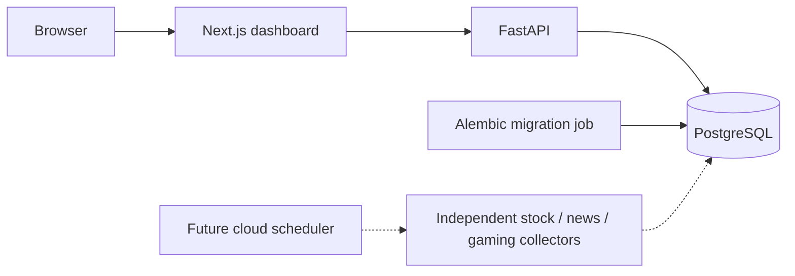

# SignalScope

A market, technology news, and gaming intelligence dashboard built in independently verified phases.

**Current status: Phase 1 foundation; not a completed or deployed MVP.** See
[implementation status](docs/IMPLEMENTATION_STATUS.md) for the acceptance gate and remaining work.

## Architecture



The frontend calls the backend from the Next.js server. Credentials are never placed in
public frontend environment variables. Future collectors will run independently from
web requests, with no AI tokens used for normal collection.

## Start with Docker

Requirements: Docker Engine / Docker Desktop with Compose v2. From this folder:

```powershell
Copy-Item .env.example .env
docker compose up --build -d
docker compose ps
Invoke-RestMethod http://localhost:8000/health
```

Open [the dashboard](http://localhost:3000) or [API docs](http://localhost:8000/docs).
The health response must be `{"status":"ok"}`. The migration service exiting with code 0
is expected. The dashboard remains available if the backend later becomes unavailable.

```powershell
docker compose logs backend
docker compose down
```

The named PostgreSQL volume survives `down`. Do not use `down -v` unless you intend to delete it.
The sample password is for local development only. Use URL-safe credentials in Compose's
constructed database URL; percent-encode credentials in URLs when configuring remote PostgreSQL.

## Native development

Requirements: Python 3.12+, Node.js 22, and PostgreSQL (Docker is convenient).

```powershell
Copy-Item .env.example .env
docker compose up -d db
cd backend
python -m venv .venv
.venv\Scripts\Activate.ps1
pip install -r requirements-dev.txt
alembic upgrade head
uvicorn app.main:app --reload
```

In another terminal, from `SignalScope`:

```powershell
cd frontend
Copy-Item .env.example .env.local
npm ci
npm run dev
```

The backend reads the root `.env` regardless of its working directory. Native Next.js
reads `frontend/.env.local`. Compose sets the internal backend hostname automatically.

## Configuration

| Variable | Purpose |
| --- | --- |
| `POSTGRES_DB`, `POSTGRES_USER`, `POSTGRES_PASSWORD` | Local Compose database |
| `DATABASE_URL` | SQLAlchemy PostgreSQL URL, using `postgresql+psycopg://` |
| `BACKEND_URL` | Server-side Next.js connection to FastAPI |
| `CORS_ORIGINS` | JSON list of explicitly allowed origins |
| `ALPHA_VANTAGE_API_KEY` | Reserved for the stock provider phase |
| `NEWS_API_KEY` | Reserved for the news provider phase |
| `XHH_REQUEST_DELAY_SECONDS` | Reserved for researched public collection |
| `NEWS_COLLECTION_INTERVAL`, `STOCK_COLLECTION_INTERVAL` | Reserved collector intervals |

Keys are not needed for Phase 1. `.env` files, virtual environments, and local tool caches
are excluded from version control. No actual provider keys are included.

## Checks

From `backend` with its virtual environment active:

```powershell
ruff check .
ruff format --check .
mypy app
pytest
alembic upgrade head
$env:RUN_DATABASE_TESTS = '1'
pytest tests/test_database_integration.py
```

The regular suite mocks the database and does not prove a PostgreSQL connection. The opt-in
integration test requires a migrated real database. CI runs both and tests migration rollback.

From `frontend`:

```powershell
npm run lint
npm run typecheck
npm run build
npm start
```

## API

| Endpoint | Behavior |
| --- | --- |
| `GET /live` | Process liveness, HTTP 200 |
| `GET /health` | HTTP 200 only with a reachable, migrated database; otherwise 503 |
| `GET /docs` | Generated OpenAPI explorer |

Watchlist, stock history, news, gaming, and dashboard data endpoints are planned for later phases.

## Deployment and automation

Dockerfiles prepare both apps for container hosting. This Compose setup is local-only and
binds published ports to loopback. No remote resources have been created. Public hosting,
TLS, managed PostgreSQL, access control, rate limiting, and provider credentials must be
configured and verified before production use.

The `.github/workflows/ci.yml` workflow expects `SignalScope` to be the repository root.
It is a verification workflow, not a collection scheduler. Collector workflows will be added
after their corresponding commands work. Cloud scheduling will allow collection while a user's
computer is off.

## Data policy and roadmap

The application uses APIs whenever possible and only collects publicly accessible web data
where necessary. Xiaoheihe inspection, robots.txt, and applicable policies must be documented
before implementing its collector. Authentication, CAPTCHA, and access controls will not be bypassed.

Next: persistent stock watchlist and Alpha Vantage adapter, then news, Xiaoheihe research,
gaming, unified summaries, and independent scheduled jobs. Optional AI daily briefs come only
after the complete non-AI pipeline passes acceptance tests.

Screenshots will be added after the foundation runs and is visually verified; no screenshot
or live data is fabricated in this scaffold.

Implementation references: [Next.js installation](https://nextjs.org/docs/app/getting-started/installation),
[FastAPI database integration](https://fastapi.tiangolo.com/tutorial/sql-databases/), and
[Compose startup dependencies](https://docs.docker.com/compose/how-tos/startup-order/).
