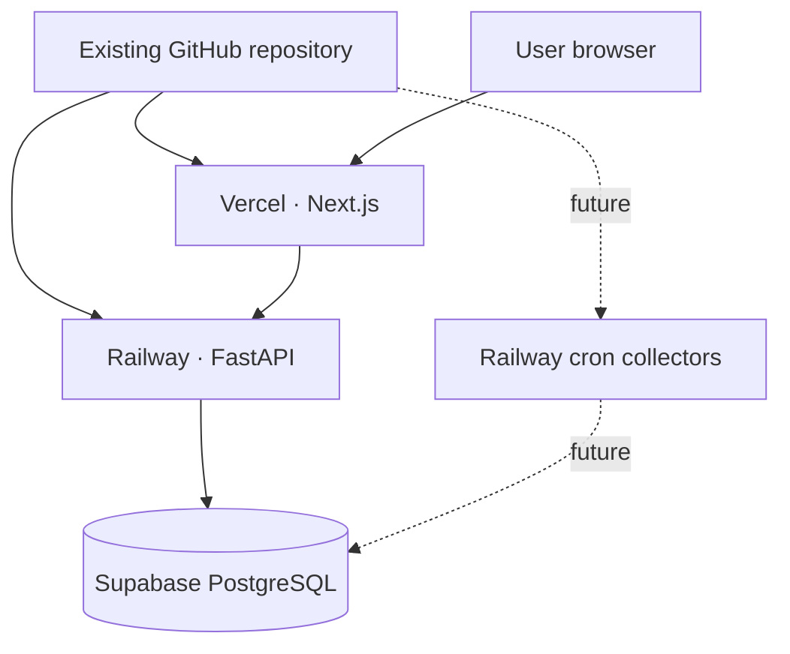

# SignalScope

Market, technology news, and gaming intelligence, built on Next.js and FastAPI.

**Current implementation: foundation shell.** This checkout has five dashboard routes, backend
health checks, SQLAlchemy, and a baseline Alembic migration. Stock/news/gaming data features
and collectors do not exist yet. Deployment configuration is prepared; cloud deployment and
a live Supabase connection are still pending.

No Docker or local PostgreSQL installation is required. Use Python 3.12, Node.js 22, and
hosted Supabase PostgreSQL.

## Architecture



The frontend still checks FastAPI from its server. Only the public API origin is exposed
through `NEXT_PUBLIC_API_URL`; database credentials and provider keys stay backend-side.
No provider calls or scraping happen on page load.

## Start here

Follow [the step-by-step cloud setup guide](docs/CLOUD_SETUP.md) to create your Supabase,
Railway, and Vercel projects using your existing GitHub repository.

This local repository currently has no Git remote. Do not create a replacement repository
or force-push over an existing one. The guide explains how to link the existing repository.

## Local backend

Create a Supabase development project and copy its **Connect → Session pooler** URI.
From the `SignalScope` root, copy the example only if you do not already have `.env`:

```powershell
Copy-Item .env.example .env
```

Edit `.env` privately. Set `DATABASE_URL` to your Supabase PostgreSQL URI, with the
`postgresql+psycopg://` scheme and `?sslmode=require`. Do not post it in chat or commit it.
The backend also accepts standard `postgresql://` and normalizes the driver.
TLS is required; stronger `verify-full` settings are preserved.

```powershell
cd backend
python -m venv .venv
.venv\Scripts\Activate.ps1
pip install -r requirements-dev.txt
alembic upgrade head
uvicorn app.main:app --reload
```

On macOS/Linux, activate with `source .venv/bin/activate`.
Open [API docs](http://localhost:8000/docs).
[Readiness](http://localhost:8000/health) must return HTTP 200 and `{"status":"ok"}`
after the database is reachable and migrated. `/live` is process liveness only.

Settings read the root `.env` regardless of the backend working directory.
Missing or invalid `DATABASE_URL` fails configuration validation without printing its value.

## Local frontend

In another terminal, from `SignalScope`:

```powershell
cd frontend
Copy-Item .env.example .env.local
npm ci
npm run dev
```

The example sets `NEXT_PUBLIC_API_URL=http://localhost:8000`.
Open [the dashboard](http://localhost:3000).
For a local production build, run `npm run build` followed by `npm start`.
The frontend has no implicit localhost API fallback.

## Environment variables

| Location | Variable | Purpose |
| --- | --- | --- |
| Root `.env` / Railway | `DATABASE_URL` | Private Supabase session-pooler or direct PostgreSQL URI |
| Root `.env` / Railway | `CORS_ORIGINS` | JSON array of exact frontend origins; defaults to none |
| Root `.env` / Railway | `FRONTEND_URL` | One additional exact frontend origin |
| Frontend `.env.local` / Vercel | `NEXT_PUBLIC_API_URL` | Public FastAPI origin; HTTPS Railway origin on Vercel |
| Railway | `PORT` | Supplied by Railway; used by Uvicorn |
| Root `.env` / future collectors | `ALPHA_VANTAGE_API_KEY`, `NEWS_API_KEY` | Reserved provider credentials |
| Root `.env` / future collectors | `XHH_REQUEST_DELAY_SECONDS` | Reserved request pacing |
| Root `.env` / future collectors | `NEWS_COLLECTION_INTERVAL`, `STOCK_COLLECTION_INTERVAL` | Reserved interval settings; do not schedule anything yet |

Frontend variables never contain database URLs, passwords, or provider keys.
Changing a public Next.js variable on Vercel requires a new build/deployment.
Vercel builds reject a missing, non-HTTPS, or loopback API origin.

## Production configuration

| Service | Repository root directory | Configuration |
| --- | --- | --- |
| Railway API | `/backend` | Config file path `/backend/railway.json`; Railpack |
| Vercel frontend | `frontend` | `frontend/vercel.json`; Next.js preset |
| Supabase | Hosted project | Existing Alembic migration applied through Railway pre-deploy |

Railway installs `requirements.txt`, runs `alembic upgrade head` before deployment,
and starts `uvicorn app.main:app --host 0.0.0.0 --port $PORT`.
It checks `/health` before making a deployment ready. No tables are manually recreated.
The existing baseline migration remains unchanged.

Connect both hosting projects to the same existing GitHub repository and production branch.
This checkout's branch is currently `master`; use the actual branch in your repository.
No remote resources, provider credentials, or cloud schedules have been created by this migration.

## Checks

From `backend`, with its virtual environment active:

```powershell
ruff check .
ruff format --check .
mypy app
pytest
```

Unit tests isolate configuration and mock database checks. They do not contact Supabase.
To test a real migrated development/test database:

```powershell
alembic upgrade head
$env:RUN_DATABASE_TESTS = '1'
pytest tests/test_database_integration.py
Remove-Item Env:RUN_DATABASE_TESTS
```

From `frontend`:

```powershell
npm run lint
npm run typecheck
npm test
npm run build
```

GitHub Actions runs these checks without a database service. An optional manually dispatched
Supabase integration job uses a dedicated `SUPABASE_TEST_DATABASE_URL` secret in the
`supabase-test` GitHub environment, on the default branch only. It applies migrations forward;
it never downgrades a shared database. No production scheduling runs in Actions.

## API and preserved UI

- `GET /live`: process liveness.
- `GET /health`: database and baseline migration readiness; returns 503 on failure.
- `GET /docs`: generated API documentation.
- Overview, Stocks, Tech News, Gaming, Settings navigation, responsive light/dark styling,
  offline/error/loading/empty states, and existing text are preserved.

## Collection and remaining work

There are no collector commands in this checkout. Do not activate cron services until the
stock, news, and gaming collectors are implemented and tested. Future schedules belong in
Railway Cron only; see [the setup guide](docs/CLOUD_SETUP.md#future-collector-services).

The application will use APIs whenever possible and only collect publicly accessible web data
where necessary. Xiaoheihe access research must precede any parser or browser deployment.
No AI tokens are used by this foundation.

[Migration audit](docs/NO_DOCKER_MIGRATION.md) ·
[Implementation status](docs/IMPLEMENTATION_STATUS.md) ·
[Verification results](docs/VERIFICATION.md)
